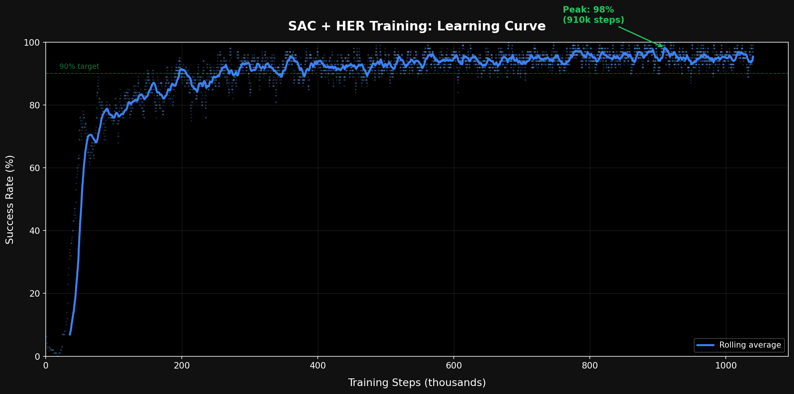

# Robot Arm Reinforcement Learning Simulation

A 3D robot arm that learns to reach targets through reinforcement learning. Place a target anywhere in 3D space, and watch the arm figure out how to reach it.

The arm isn't programmed with movement instructions. Instead, it learns through trial and error using Hindsight Experience Replay (HER), a technique where even failed attempts teach the agent something useful. After ~1,000,000 practice attempts, the arm reliably reaches targets across its entire workspace.

## How It Works

The simulation runs a 3-joint robot arm inside a physics engine (PyBullet). A neural network controls the arm by deciding how much to rotate each joint at every step. The network is trained using SAC (Soft Actor-Critic), an algorithm that balances exploring new strategies with exploiting what already works.

The key challenge: reaching a precise 3D target with only 3 joints requires coordinating all of them simultaneously. Early in training, the arm flails randomly. By the end, it smoothly reaches any reachable target in under 15 steps.

### Training Approach

- **Hindsight Experience Replay (HER):** When the arm misses a target, HER asks "what if the place I actually reached was the target?" This turns every failure into a success for a different goal, dramatically speeding up learning.
- **Hybrid Reward:** The arm gets a sparse signal (did I reach the target or not?) combined with an exponential proximity bonus that increases as it gets closer. The sparse signal helps HER work, the proximity bonus helps with precision.
- **Cylindrical Workspace:** Targets are sampled within the arm's analytically-derived reachable volume (a cylinder that narrows at higher elevations), with 35% of targets biased toward workspace edges where reaching is hardest.
- **Two-Phase Training:** Phase 1 trains for the full step budget and tracks the peak success rate. Phase 2 continues until the rate re-reaches that peak, ensuring the final model is saved at a high point rather than in a valley.

### Training Curve



### Architecture

The backend runs a FastAPI server that loads the trained neural network and a headless physics simulation. When you place a target in the web interface, the server runs the agent for up to 75 steps, recording the arm's joint angles at each step. The frontend receives this trajectory and animates it in 3D using Three.js.

```
Frontend (Three.js)  →  API request with target position
                     ←  Trajectory of joint angles
Backend (FastAPI)    →  Neural network decides joint movements
                     →  Physics engine simulates arm response
                     →  Repeat for 75 steps
```

## Tech Stack

- **Physics:** PyBullet with a custom 3-link URDF (base rotation + shoulder + elbow)
- **Training:** Stable-Baselines3 (SAC + HER), 8 parallel environments, ~15 min on M4 Pro CPU
- **Backend:** FastAPI serving inference from trained checkpoints
- **Frontend:** Three.js with interactive target placement and checkpoint selection
